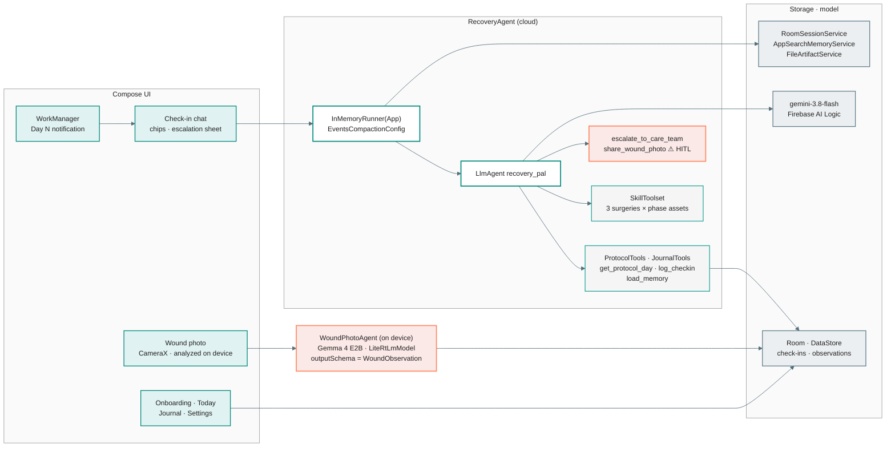
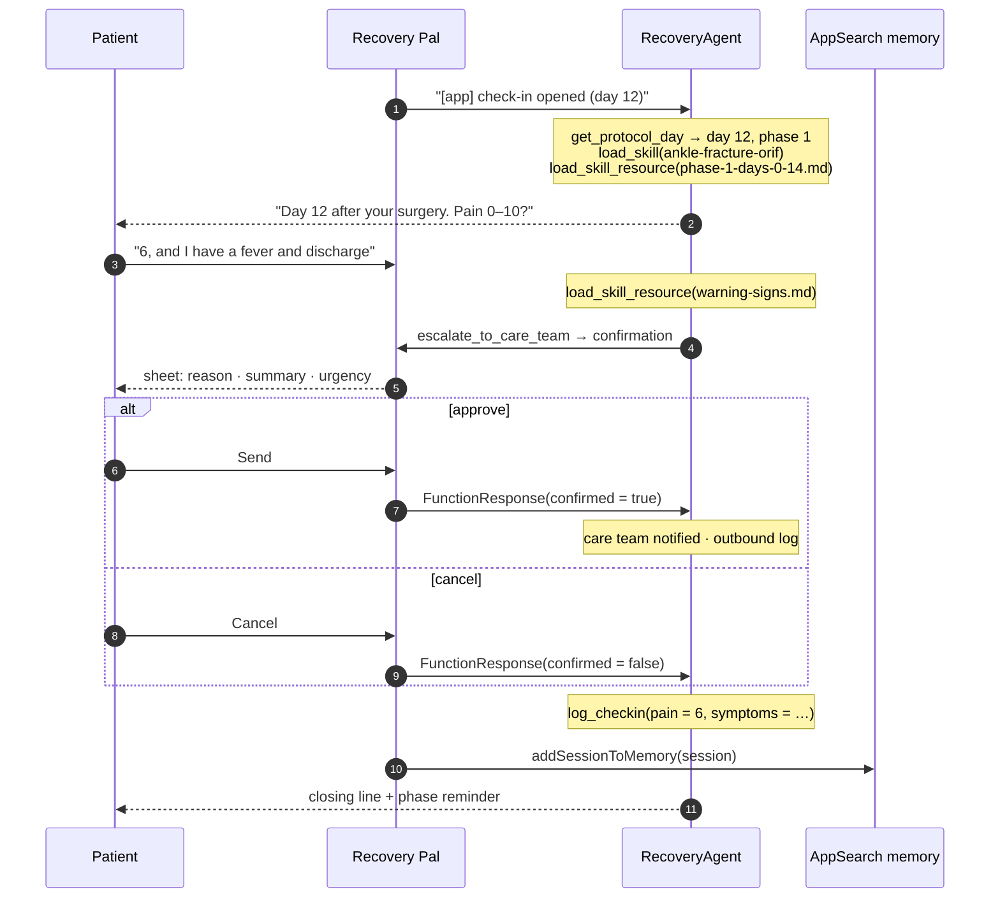

# Recovery Pal — ADK for Kotlin demo

A post-operative companion that follows the patient for weeks: one daily check-in with a cloud
agent that reads the surgery's protocol **skill** phase by phase, a wound-photo observer that runs
**entirely on the device**, and a care-team escalation that never happens without the patient's
explicit approval. Built with [ADK for Kotlin](https://github.com/google/adk-kotlin) 1.0.1.

> Educational demo, not a medical device. It does not diagnose. Protocol text is illustrative.

## What you'll learn

| ADK feature | Where |
|---|---|
| `SkillToolset` + `AssetSkillSource`: one skill per surgery, one asset per phase, loaded only when the day matches | `assets/skills/*`, `agent/Agents.kt` |
| Session resumability with `RoomSessionService`: **one session for the whole episode**, appended to every day | `agent/AgentRuntime.kt`, `ui/checkin/` |
| Context compaction (`App` + `EventsCompactionConfig` + `LlmEventSummarizer`) so a 6-week session stays bounded | `AgentRuntime.recoveryRunner`, Settings → Session |
| On-device memory with `AppSearchMemoryService` + `LoadMemoryTool` ("it hurts more in the mornings" recalled weeks later) | `AgentRuntime.indexSessionInMemory`, the `load_memory` chip |
| Hybrid: cloud `LlmAgent` (Firebase AI Logic, `gemini-3.8-flash`) and on-device `LlmAgent` (`LiteRtLmModel`, Gemma 4 E2B) sharing one app | `agent/Agents.kt` |
| Image input on device: the JPEG goes to the model as `Part(inlineData = Blob("image/jpeg"))` and never to the cloud | `AgentRuntime.analyzeWound` |
| Structured output (`outputSchema`) for the descriptive `WoundObservation` | `agent/WoundObservation.kt` |
| Human-in-the-loop (`requireConfirmation = true`) for `escalate_to_care_team` and `share_wound_photo` | `agent/Tools.kt`, `ui/components/ConfirmationSheet.kt` |
| `FileArtifactService` for private photo storage | `AgentRuntime.savePhoto` |
| WorkManager as the trigger: the OS posts "Day N check-in", the worker never calls the model | `work/ReminderWorker.kt` |
| Tool errors via `FunctionTool.ERROR_KEY` | `agent/Tools.kt` |

## Architecture



### A check-in that escalates



## Setup

1. **Firebase**: register `dev.ykro.recoverypal` in your Firebase project, enable Firebase AI Logic
   and drop `google-services.json` into `app/`. The app builds without it; the check-in then reports
   "Firebase is not configured".
   **App Check**: Firebase AI Logic rejects unattested requests once enforcement is on. Register the
   signing certificate's SHA-256 (`./gradlew signingReport`) for Play Integrity; debug builds install
   the *debug provider* instead (`src/debug/.../AppCheckSetup.kt`), so on first launch copy the token
   logcat prints (`Enter this debug secret into the allow list`) into App Check → *Manage debug tokens*.
2. **On-device model** (wound photos): Settings → *Download over Wi-Fi*, or
   `adb push gemma-4-E2B-it.litertlm /sdcard/Android/data/dev.ykro.recoverypal/files/`.
   Without it the photo screen says analysis is unavailable and never falls back to the cloud.
3. `./gradlew :app:installDebug` (JDK 17+; Gradle 9.7.1 / AGP 9.4.0 pinned by the wrapper).

## Demo script (~75 s)

1. Onboarding: pick *Ankle fracture (ORIF surgery)*, 12 days ago, reminder time, care-team contact.
2. Settings → *Notify now* → the "Day 12 check-in" notification opens the check-in.
3. Chips: `get_protocol_day` → `load_skill(ankle-fracture-orif)` → `load_skill_resource(assets/phase-1-days-0-14.md)`. Only phase 1.
4. Wound photo (emulator camera works): "Analyzing on your device · nothing leaves your phone",
   then the observation card. Turn on airplane mode first to show the "no network" badge.
5. Back in the check-in, mention fever and discharge: `load_skill_resource(assets/warning-signs.md)`
   → `escalate_to_care_team` → approval sheet → *Send*. Settings → *Data that left the device* lists
   the escalation; the photo is not there.
6. Settings → simulated *Day 30* → new check-in loads `phase-2-days-15-42.md`.
7. `adb shell am force-stop dev.ykro.recoverypal`, reopen mid check-in: the conversation resumes from Room.
8. After several check-ins, Settings → Session shows the event count and compaction summaries.

## Verified on the emulator (Pixel_9_API_36)

Onboarding, Today (phase asset read straight from the skill), on-device wound photo with the
emulated camera (schema-valid `WoundObservation` in ~3 min on the emulator CPU), journal, WorkManager
notification and its deep link into the check-in. The cloud check-in (skills, compaction, memory,
escalation) needs your `google-services.json`.

## Layout

```
app/src/main/kotlin/dev/ykro/recoverypal/
  agent/   RecoveryAgent (cloud) + WoundPhotoAgent (on-device), tools, schema, runtime, model store
  data/    Surgery/phase model, Room (check-ins, observations, outbound log), DataStore patient config
  work/    WorkManager reminder + notification
  ui/      onboarding, today, checkin, wound (CameraX), journal, settings
app/src/main/assets/skills/<surgery>/SKILL.md + assets/phase-*.md, warning-signs.md, ...
app/src/test/   phase boundaries, WoundObservation schema/parse
```
